# Scenthesis Project Architecture Flowchart

Paste the Mermaid block below into a Mermaid-enabled editor or Excalidraw Mermaid import.

```mermaid
flowchart LR
    %% Inputs
    subgraph I["Input Sources"]
        prompt["Text prompt / task request"]
        assets["Asset files and manifests"]
        scans["Image scans / visual profiles"]
        robot["Robot CAD / Panda MJCF specifications"]
    end

    %% Scene synthesis
    subgraph S["Scene Synthesis Pipeline"]
        faithful["FAITHFUL scene generation"]
        layout["Layout generation"]
        retrieval["Object retrieval"]
        materials["Material / texture assignment"]
        taskdef["Task definition"]
        relations["Objects / zones / floor hierarchy"]
        placement["Object placement"]
        objrel["Object relationship graph"]
    end

    %% Intermediate representations
    subgraph R["Simulation-Ready Representations"]
        sceneir["SceneIR generation"]
        validation["Scene and task validation"]
        visualid["Visual identity report"]
        mjcf["MJCF emitter"]
        manifests["Entity / coordinate / camera manifests"]
        openusd["OpenUSD / visual twin path"]
        compiled["Compiled MuJoCo scene XML / MJB"]
    end

    %% Runtime and teacher
    subgraph M["Physics Engine and Visual Renderer"]
        mujoco["MuJoCo physics runtime"]
        renderer["RGB cameras / debug renderer"]
        env["MuJoCoEnv observation and step API"]
    end

    subgraph T["Teacher Planning and Execution"]
        policy["TeacherPickPlacePolicy"]
        base["Base candidate selection"]
        grasp["Grasp candidate selection"]
        waypoints["Joint waypoint plan"]
        gate0["Gate 0 checks: IK, limits, static clearance"]
        probe["Grasp probe: approach, settle, micro-lift"]
        completion["Completion probe: strict rollout preview"]
        strict["Strict evaluator execution"]
    end

    subgraph Q["Qualification Gates"]
        planok["teacher_plan.ok"]
        graspok["grasp_probe.feasible"]
        liftok["stable_grasp and target_lifted"]
        placeok["place descent before release"]
        collisionok["collision_count = 0"]
        success["stable final placement / success"]
    end

    %% Dataset and training
    subgraph D["Demonstration and Dataset Outputs"]
        traces["Episode traces and metrics"]
        rgb["RGB frame streams"]
        videos["MP4 demo videos"]
        accept["Accepted episode export logic"]
        demos["Accepted demo root"]
        canonical["Canonical LeRobot dataset"]
        train["LeRobot policy training"]
    end

    %% Debug and regression
    subgraph F["Debug and Regression Loop"]
        micro["Deterministic micro-lift harness"]
        reports["Plan, probe, compile, runtime reports"]
        tests["Regression tests"]
        fixes["Planner / SceneIR / evaluator fixes"]
    end

    %% Primary data flow
    prompt --> faithful
    assets --> retrieval
    scans --> retrieval
    robot --> sceneir

    faithful --> layout
    layout --> retrieval
    retrieval --> materials
    materials --> taskdef
    taskdef --> relations
    relations --> placement
    placement --> objrel

    objrel --> sceneir
    sceneir --> validation
    validation --> visualid
    validation --> mjcf
    sceneir --> manifests
    sceneir --> openusd
    mjcf --> compiled

    compiled --> mujoco
    manifests --> env
    robot --> mujoco
    mujoco --> env
    renderer --> env

    env --> policy
    policy --> base
    base --> grasp
    grasp --> waypoints
    waypoints --> gate0
    gate0 --> probe
    probe --> completion
    completion --> strict

    strict --> planok
    strict --> graspok
    strict --> liftok
    strict --> placeok
    strict --> collisionok
    strict --> success

    success --> traces
    env --> rgb
    rgb --> videos
    traces --> accept
    rgb --> accept
    accept --> demos
    demos --> canonical
    canonical --> train

    %% Feedback flow
    strict --> reports
    probe --> micro
    reports --> fixes
    micro --> fixes
    tests --> fixes
    fixes --> sceneir
    fixes --> policy
    fixes --> strict

    %% Styling
    classDef input fill:#242a2e,stroke:#ff8a80,color:#f4f4f4;
    classDef synth fill:#263238,stroke:#ff8a80,color:#f4f4f4;
    classDef repr fill:#1f2f25,stroke:#4caf50,color:#f4f4f4;
    classDef runtime fill:#102a3d,stroke:#42a5f5,color:#f4f4f4;
    classDef teacher fill:#30243b,stroke:#b388ff,color:#f4f4f4;
    classDef gate fill:#3a2b18,stroke:#ffc107,color:#f4f4f4;
    classDef data fill:#253047,stroke:#64b5f6,color:#f4f4f4;
    classDef debug fill:#2f2525,stroke:#ef5350,color:#f4f4f4;

    class prompt,assets,scans,robot input;
    class faithful,layout,retrieval,materials,taskdef,relations,placement,objrel synth;
    class sceneir,validation,visualid,mjcf,manifests,openusd,compiled repr;
    class mujoco,renderer,env runtime;
    class policy,base,grasp,waypoints,gate0,probe,completion,strict teacher;
    class planok,graspok,liftok,placeok,collisionok,success gate;
    class traces,rgb,videos,accept,demos,canonical,train data;
    class micro,reports,tests,fixes debug;
```

## Compact Layout For The Existing Sketch

Use these box groups if you want to finish the current hand-drawn diagram instead of importing Mermaid:

1. Input Sources
   - Text prompt
   - Asset files and manifests
   - Image scans / visual profiles
   - Robot CAD / Panda MJCF specifications

2. Scene Synthesis
   - FAITHFUL scene generation
   - Layout generation
   - Object retrieval
   - Material / texture assignment
   - Task definition
   - Object placement
   - Object relationship graph
   - Objects / zones / floor hierarchy

3. Simulation-Ready Representation
   - SceneIR generation
   - Scene and task validation
   - Visual identity report
   - MJCF emitter
   - Entity / coordinate / camera manifests
   - OpenUSD / visual twin path
   - Compiled XML / MJB

4. MuJoCo Runtime
   - MuJoCo physics
   - RGB cameras / debug renderer
   - MuJoCoEnv observation and step API

5. Teacher and Strict Evaluator
   - TeacherPickPlacePolicy
   - Base candidate selection
   - Grasp candidate selection
   - Joint waypoint plan
   - Gate 0: IK, joint limits, static clearance
   - Grasp probe: approach, settle, micro-lift
   - Completion probe: strict rollout preview
   - Strict evaluator execution

6. Acceptance and Data Export
   - teacher_plan.ok
   - grasp_probe.feasible
   - stable_grasp and target_lifted
   - release after place descent
   - collision_count = 0
   - stable final placement / success
   - accepted episode export logic
   - RGB frame streams
   - MP4 demos
   - canonical LeRobot dataset
   - LeRobot policy training

7. Debug Feedback Loop
   - Deterministic micro-lift harness
   - Plan / probe / compile / runtime reports
   - Regression tests
   - Planner / SceneIR / evaluator fixes
